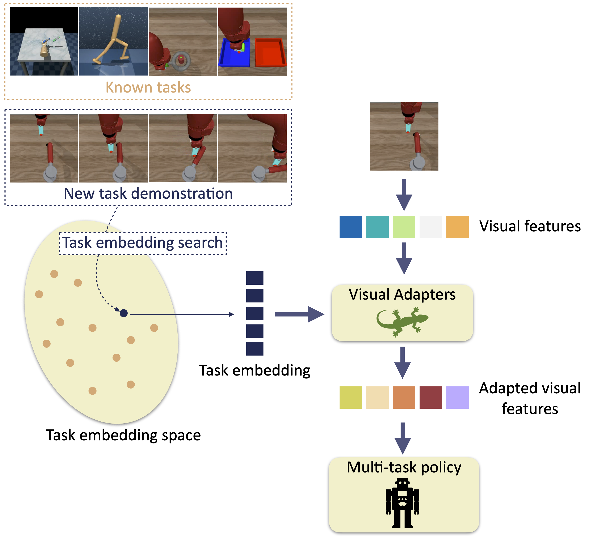

# Task-conditioned adaptation of visual features in multi-task policy learning
### [Project Page](https://pierremarza.github.io/projects/task_conditioned_adaptation/) | [Paper](https://arxiv.org/abs/2402.07739)

[Task-conditioned adaptation of visual features in multi-task policy learning](https://arxiv.org/abs/2402.07739)  
 [Pierre Marza](https://pierremarza.github.io/)<sup>1</sup>,
 [Laetitia Matignon](https://perso.liris.cnrs.fr/laetitia.matignon/)<sup>2</sup>,
 [Olivier Simonin](http://perso.citi-lab.fr/osimonin/)<sup>1</sup>,
 [Christian Wolf](https://chriswolfvision.github.io/www/)<sup>3</sup> <br>
 <sup>1</sup>INSA Lyon, <sup>2</sup>Université Lyon 1, <sup>3</sup>Naver Labs Europe <br>
in CVPR 2024



## Setup
Some parts of the code are adapted from https://github.com/facebookresearch/eai-vc. We thus follow some of the instructions from https://github.com/facebookresearch/eai-vc/blob/main/INSTALLATION.md to install the required dependencies. Commands to run are listed below,
```console
# Cloning VC-1 code repository
git clone  https://github.com/facebookresearch/eai-vc.git
cd eai-vc
git submodule update --init --recursive

# Creating a conda environment and activating it
conda env create -f environment.yml
conda activate eai-vc

# Downloading mujoco dependencies
mkdir ~/.mujoco
wget https://www.roboti.us/download/mujoco200_linux.zip -P ~/.mujoco
unzip ~/.mujoco/mujoco200_linux.zip
wget https://www.roboti.us/file/mjkey.txt -P ~/.mujoco

# Installing mujoco-py (GPU-compiled)
pip install -e ./third_party/mujoco-py

# Installing mj_envs/mjrl
pip install -e ./third_party/mj_envs
pip install -e ./third_party/mjrl
pip install -e ./third_party/dmc2gym

# Installing vc_models
pip install -e ./vc_models

# Updating environment variables
export LD_LIBRARY_PATH=$LD_LIBRARY_PATH:~/.mujoco/mujoco200/bin
export MUJOCO_GL=egl
```

## Data (demonstrations)
We will start by simply creating the main *data* folder where we will place all required data.
```console
# Creating the data folder
mkdir data
```

### Training demonstrations
Training demonstrations can be downloaded by following a part of the instructions from https://github.com/facebookresearch/eai-vc/tree/main/cortexbench/mujoco_vc#downloading-demonstration-datasets. We list the commands to run below,

```console
# Entering the data folder
cd data

# Creating the train folder
mkdir train
cd train

# Downloading Adroit demonstrations
wget https://dl.fbaipublicfiles.com/eai-vc/adroit-expert-v1.0.zip
unzip adroit-expert-v1.0.zip
rm adroit-expert-v1.0.zip

# Downloading MetaWorld demonstrations
wget https://dl.fbaipublicfiles.com/eai-vc/mujoco_vil_datasets/metaworld-expert-v1.0.zip
unzip metaworld-expert-v1.0.zip
rm metaworld-expert-v1.0.zip

# Downloading DMC demonstrations
wget https://dl.fbaipublicfiles.com/eai-vc/mujoco_vil_datasets/dmc-expert-v1.0.zip
unzip dmc-expert-v1.0.zip
rm dmc-expert-v1.0.zip 
```

### Few-shot demonstrations
We have generated expert demonstrations for 15 new MetaWorld tasks using [TD-MPC2 single-task checkpoints](https://www.tdmpc2.com/models). 
Few-shot expert demonstrations can be downloaded [here](https://drive.google.com/file/d/1dG0EOyrEKzomJikOyLzP_EfgEzytra3G/view?usp=sharing). Download the *few_shot.tar.gz* file, and then follow the introductions below,

```console
# Move the downloaded file into the data folder
mv few_shot.tar.gz data/

# Uncompress
cd data
tar -xvf few_shot.tar.gz

# Remove the downloaded file
rm few_shot.tar.gz
```

You should now have a *few_shot* folder containing 15 pickle files (one for each unknown task).

## Pre-trained models
We will start by simply creating the *pre_trained_models* folder.
```console
# Creating the pre_trained_models folder
mkdir pre_trained_models
```

### Pre-trained VC-1 ViT-B checkpoints 
```console
# Entering the pre_trained_models folder
cd pre_trained_models

# Downloading pre-trained VC-1 ViT-B checkpoint
wget https://dl.fbaipublicfiles.com/eai-vc/vc1_vitb.pth
```

### Pre-trained adapters
You can download the model which achieved the highest validation average performance accross tasks (Table 1 row (f) in our paper, best of the 3 runs on validation episodes) [here](https://drive.google.com/file/d/1xIZOJWJMCj-UaA63yr3cUnNgmYgjlVow/view?usp=sharing). Then, place the downloaded file in the *pre_trained_models* folder,
```console
# Move the downloaded file into the pre_trained_models folder
mv best_model_val_middle_adapter_cond_top_adapter_cond_policy_cond_ckpt_50.pth pre_trained_models/
```

## Training
To train a model with a random seed fixed to 100 (*--seed 100*), middle and top adapters conditioned on learnt task embeddings (*--middle_adapter_type middle_adapter_cond* and *-top_adapter_type top_adapter_cond*), a multi-task policy also conditioned on the task (*--policy_type policy_cond*), with our tokens aggregation method insead to 'CLS' token (*--use_cls 0*), you can run the command below. You can also specify an experiment name with the *expe_name* flag (*--expe_name train_with_conditioned_adapters*).

```console
python -u src/run/train.py --seed 100 --middle_adapter_type middle_adapter_cond --top_adapter_type top_adapter_cond --policy_type policy_cond --use_cls 0 --expe_name train_with_conditioned_adapters
```

## Evaluation on known tasks
Once your model is trained, you can load a specific checkpoint with the *eval_model_ckpt_path* flag (*--eval_model_ckpt_path pre_trained_models/best_model_val_middle_adapter_cond_top_adapter_cond_policy_cond_ckpt_50.pth*) and validate it on a known task (*--eval_type val_known*) by specifying it with the *eval_env* flag (*--eval_env dmc_walker_stand-v1*). After validating on validation episodes, you can test the checkpoint by simply changing *--eval_type* to *test_known*. You should also specify the same values for the *middle_adapter_type*, *top_adapter_type*, *policy_type* and *use_cls* flags as during training. You can then change *--eval_env* to validate or test on any of the 12 known tasks.

Validation on *dmc_walker_stand-v1*
```console
python -u src/run/eval.py --middle_adapter_type middle_adapter_cond --top_adapter_type top_adapter_cond --policy_type policy_cond --use_cls 0 --eval_model_ckpt_path pre_trained_models/best_model_val_middle_adapter_cond_top_adapter_cond_policy_cond_ckpt_50.pth --eval_type val_known --eval_env dmc_walker_stand-v1 --expe_name val_known_best_model
```

Test on *assembly-v2-goal-observable*
```console
python -u src/run/eval.py --middle_adapter_type middle_adapter_cond --top_adapter_type top_adapter_cond --policy_type policy_cond --use_cls 0 --eval_model_ckpt_path pre_trained_models/best_model_val_middle_adapter_cond_top_adapter_cond_policy_cond_ckpt_50.pth --eval_type test_known --eval_env assembly-v2-goal-observable --expe_name test_known_best_model
```

Known tasks are:
* *dmc_walker_stand-v1* (DMC)
* *dmc_walker_walk-v1* (DMC)
* *dmc_reacher_easy-v1* (DMC)
* *dmc_cheetah_run-v1* (DMC)
* *dmc_finger_spin-v1* (DMC)
* *pen-v0* (Adroit)
* *relocate-v0* (Adroit)
* *assembly-v2-goal-observable* (MetaWorld)
* *bin-picking-v2-goal-observable* (MetaWorld)
* *button-press-topdown-v2-goal-observable* (MetaWorld)
* *drawer-open-v2-goal-observable* (MetaWorld)
* *hammer-v2-goal-observable* (MetaWorld)

To compute performance scores as done in our paper (Table1: *Adroit*, *DMC*, *MetaWorld*, *Benchmarks avg*, *Tasks avg*), you will need to evaluate your model on all 12 known tasks (running the above command 12 times with the 12 different possible task names for the *--eval_env* flag). We do not provide a specific script to automatically evaluate all tasks as people might want to do it differently depending on their setup (sequentially or in parallel, with different job schedulers, etc.). For each task, you will get a *mean_score*, and can compute performance scores as follows,

* *Adroit*: average of *mean_score* values for *pen-v0* and *relocate-v0*.
* *DMC*: average of *mean_score* values for *dmc_walker_stand-v1*, *dmc_walker_walk-v1*, *dmc_reacher_easy-v1*, *dmc_cheetah_run-v1*, *dmc_finger_spin-v1*.
* *MetaWorld*: average of *mean_score* values for *assembly-v2-goal-observable*, *bin-picking-v2-goal-observable*, *button-press-topdown-v2-goal-observable*, *drawer-open-v2-goal-observable* and *hammer-v2-goal-observable*.
* *Benchmarks avg*: average of *Adroit*, *DMC* and *MetaWorld*.
* *Tasks avg*: average of all 12 task *mean_score* values.

If you have used the same config for all 12 tasks (including same *--expe_name*), you will end up with a folder containing one logging sub-folder per known task. In this case, you can run the following script to compute all metrics,

Example for all known task test runs (same can be done for validation runs)
```console
python -u src/utils/compute_metrics_known_tasks.py --logs_folder_path logs/test_known/500_middle_adapter_cond_top_adapter_cond_policy_cond_False_test_known_best_model/logs/
```

## Evaluation on unknown tasks (few-shot)
A validated checkpoint can then be tested on an unknown task in a few-shot manner, i.e. provided only a few demonstrations of the task (5 in our experiments). To this end, you first need to optimize a new task embedding for the considered unknown task with the command below (same flags as before, specifying the task with again the *--eval_env* flag),

Task embedding search on *faucet-close-v2-goal-observable*
```console
python -u src/run/task_embedding_search.py --middle_adapter_type middle_adapter_cond --top_adapter_type top_adapter_cond --policy_type policy_cond --use_cls 0 --eval_model_ckpt_path pre_trained_models/best_model_val_middle_adapter_cond_top_adapter_cond_policy_cond_ckpt_50.pth --eval_env faucet-close-v2-goal-observable --expe_name te_search_best_model
```

Then, you can use the same evaluation command as in the previous section, only changing *--eval_type* to *test_unkown* and *--eval_env* to the unknown task of interest.

Test on *faucet-close-v2-goal-observable*
```console
python -u src/run/eval.py --middle_adapter_type middle_adapter_cond --top_adapter_type top_adapter_cond --policy_type policy_cond --use_cls 0 --eval_model_ckpt_path pre_trained_models/best_model_val_middle_adapter_cond_top_adapter_cond_policy_cond_ckpt_50.pth --eval_type test_unknown --eval_env faucet-close-v2-goal-observable --eval_te_ckpt_path logs/te_search/ckpts/100_middle_adapter_cond_top_adapter_cond_policy_cond_False_te_search_best_model/ckpt_faucet-close-v2-goal-observable.pth --expe_name test_unkown_best_model
```

Unknown tasks are:
* *button-press-wall-v2-goal-observable* (MetaWorld)
* *button-press-topdown-wall-v2-goal-observable* (MetaWorld)
* *faucet-close-v2-goal-observable* (MetaWorld)
* *faucet-close-v2-goal-observable* (MetaWorld)
* *door-open-v2-goal-observable"* (MetaWorld)
* *door-close-v2-goal-observable* (MetaWorld)
* *drawer-close-v2-goal-observable* (MetaWorld)
* *window-close-v2-goal-observable* (MetaWorld)
* *peg-insert-side-v2-goal-observable* (MetaWorld)
* *plate-slide-v2-goal-observable* (MetaWorld)
* *plate-slide-back-v2-goal-observable* (MetaWorld)
* *plate-slide-back-side-v2-goal-observable* (MetaWorld)
* *handle-press-v2-goal-observable* (MetaWorld)
* *handle-press-side-v2-goal-observable* (MetaWorld)
* *push-back-v2-goal-observable* (MetaWorld)


## Citation
```
@inproceedings{marza2024_task_conditioned_adaptation,
    author    = {Marza, Pierre and Matignon, Laetitia and Simonin, Olivier and Wolf, Christian},
    title     = {Task-conditioned adaptation of visual features in multi-task policy learning},
    booktitle = {Computer Vision and Pattern Recognition (CVPR)},
    year      = {2024},
}
```
